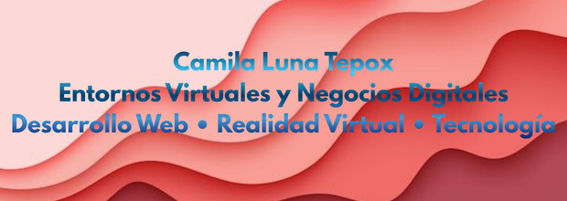
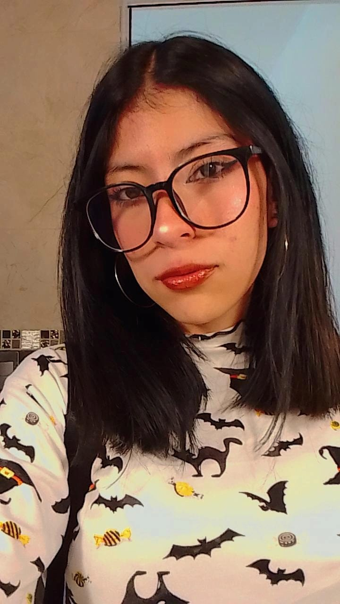

<h1 align="center">Hola 👋, soy Camila Luna Tepox</h1>
<h3 align="center">Estudiante de Entornos Virtuales y Negocios Digitales</h3>

  

👩‍💻 Sobre mí

Soy estudiante de la carrera en Entornos Virtuales y Negocios Digitales con enfoque en la gestión de proyectos tecnológicos
y el desarrollo de soluciones digitales. Cuento con experiencia en proyectos académicos como diseño de páginas web, 
fortaleciendo mis habilidades técnicas.

Destaco por mi creatividad, por mi capacidad para trabajar en equipo, por ser organizada, me gusta enfrentar retos 
que me permitan desarrollar mis capacidades dentro del ámbito digital.

 🚀 Proyectos destacados

🚗**Sistema Web de Inventario para Corralones Vehiculares**
🧍🏻**Cortrometajes sobre el dia internacional de la mujer**
🧸**Catalogo de juguetes, con modelados 3D**

🧠 Tecnologías que uso

💻 Lenguajes

- HTML  
- CSS  
- JavaScript  
- Python  

⚙️ Frameworks

- Django  
- Bootstrap  

🗄️ Base de datos

- PostgreSQL  

🛠️ Herramientas

- Visual Studio Code  
- GitHub  
- Unity  
- Blender

 **Cursos**
 **"SanaMente LibreMente: jóvenes por la paz y contra las adicciones"**
 https://drive.google.com/file/d/1bR2helZ2CAzumuSTv2_c3WX32YW_zSpp/view?usp=sharing
  
**Desarrollador de sitios web responsivos**
 https://drive.google.com/file/d/16rPqXP1hH9nvUi6t4R23qL372op5ahWJ/view?usp=sharing

  **Reconocimientos**
  
  **taller: "introducción a la criptografia del 1er. Congreso de Tecnologia y Ciberseguridad**
  https://drive.google.com/file/d/1buHhRXtLBEKRqqcXP36sGbQfqQLPgyqq/view?usp=sharing
  
  **Segundo Congreso de Tecnología y Ciberseguridad**
https://drive.google.com/file/d/1VhNgX3-FkQy7qELEC7t79117U4rtoDO3/view?usp=sharing

**taller: “Diseño publicitario digital”**
https://drive.google.com/file/d/1xTqOMm-pFSGbJZ5QkoKfXZqKI7kOoX2y/view?usp=sharing

**Cortometraje dia internacional de la mujer**
https://drive.google.com/file/d/1ODuuv4tQlSgtGlpT-kUHUGgoY8bIckmt/view?usp=sharing

**Idiomas**
B1

 📫 Contacto

✉️ Email: camilluna123@gmail.com 
📘 Facebook:https://www.facebook.com/luna.cam.348792
📸 Instagram: https://www.instagram.com/ctl._.cam/

⭐ Gracias por visitar mi perfil

LINK PDF CV
